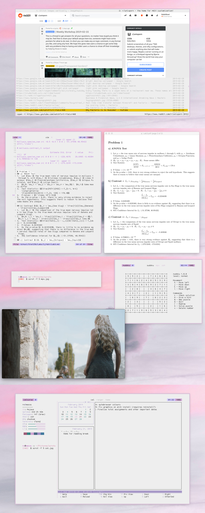

# Dotfiles

In this respository my few and sparse configs lie.

The below screenshot showcases most of my daily workflow. The programs are:

* [qutebrowser](https://qutebrowser.org/)
* [vim](https://www.vim.org/) / [skim](https://skim-app.sourceforge.io/) (although I am always looking for a better pdf viewer – one without a title bar!)
* [calcurse](https://www.calcurse.org/) / [ranger](https://github.com/ranger/ranger)
* [mpv](https://mpv.io/)
* [nudoku](https://github.com/jubalh/nudoku)
* [neofetch](https://github.com/dylanaraps/neofetch)
* with my own ZSH prompt, which can be found here.

Font used is GohuFont.

