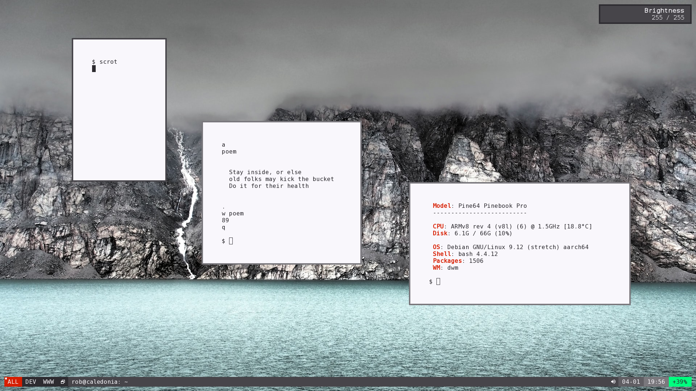

# Dotfiles

## Introduction
In this respository my few and sparse configs lie.

The below screenshot shows most of my day-to-day workflow. The programs are:

* qutebrowser
* vim
* skim, although I am always looking for a better pdf viewer. Prefferably without a title bar!
* calcurse
* ranger
* mpv
* [nudoku](https://github.com/jubalh/nudoku)
* neofetch

Along with config files for all the programs I use most often, my custom ZSH prompt as seen below can be found in this repo.

